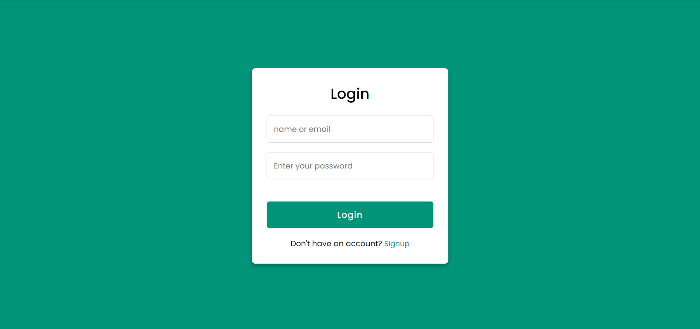
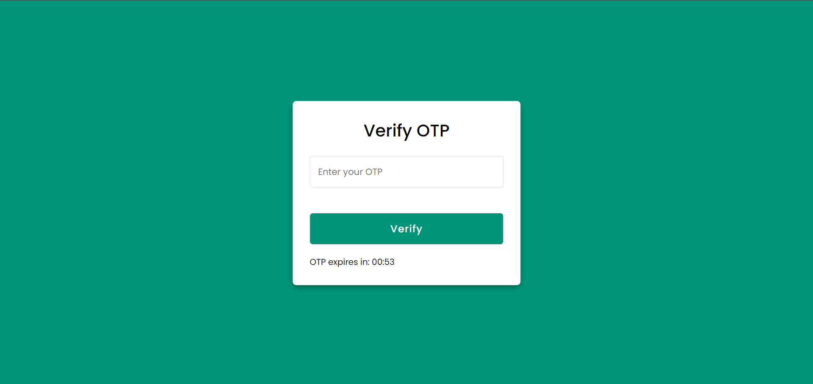
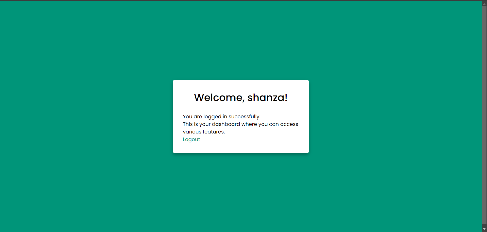

# Flask OTP Verification Web Application

## Project Description

This is a simple web application built using Flask that allows users to register, receive a One-Time Password (OTP) via email, and verify their identity by entering the OTP. The application includes user authentication, registration with OTP-based email verification, and a dashboard for logged-in users. OTP verification is time-sensitive, and the OTP expires after a defined period.

## Key Features:
- **User Registration with OTP Verification:** Users register with a username, email, and password. Upon registration, an OTP is sent to their email for verification.
- **OTP Expiration:** OTPs expire after 5 minutes, and users are redirected to re-register if their OTP expires.
- **User Login:** Users can log in using their username and password after OTP verification.
- **User Dashboard:** Once logged in, users can access a protected dashboard.
- **Logout:** Users can log out, and their session will be cleared.

## Technologies Used
- **Frontend:** HTML, CSS, Bootstrap, javascript
- **Backend:** Python, Flask
- **Database:** SQLite
- **Email Service:** Gmail SMTP
- **Libraries:** Flask-SQLAlchemy, Flask-Login, Flask-Mail, pyotp

## Project Structure:
- **Login and Registration:** The app uses Flask-Login for user session management. The user provides a username and password to register or log in.
- **OTP Verification:** Upon registration, the user receives an OTP via email, which must be entered to complete the registration. The OTP expires after 5 minutes.
- **Session Management:** Flask sessions store temporary user and OTP data. Login sessions are maintained until logout or browser closure.
- **Timeout:** The OTP verification page includes a countdown timer for the OTP validity period (5 minutes).

## Installation and Usage Instructions

### Prerequisites
- **Python 3.x** installed on your machine.
- Install necessary packages via pip.

### Installation Steps
1. **Clone the Repository:**
    
    git clone <repository-url>
    cd <repository-directory>
    

2. **Install Python Dependencies:**
    Install required Python libraries by running:
    
    Flask==3.0.3
    Flask-SQLAlchemy==3.1.1
    Flask-Login==0.6.3
    Flask-Mail==0.9.1
    Werkzeug==3.0.4
    pyotp==2.6.0

    

3. **Create the Database:**
   The SQLite database will be created automatically when the app runs for the first time. There is no need for additional setup.

4. **Configure Email for OTP (Gmail):**
    - Set up a Gmail account to send OTP emails.
    - Enable **Less Secure App Access** in the Gmail account settings.
    - Replace the placeholders in `app.config['MAIL_USERNAME']` and `app.config['MAIL_PASSWORD']` with your Gmail credentials:
    
    app.config['MAIL_USERNAME'] = 'your-email@gmail.com'  
    app.config['MAIL_PASSWORD'] = 'your-email-password'
    

### Usage Instructions

1. **Run the Application:**  
   Start the Flask application by running the following command:
   
   python app.py

## Screenshots

### Login Page

### Registration Page

### OTP Verification

### Dashboard

